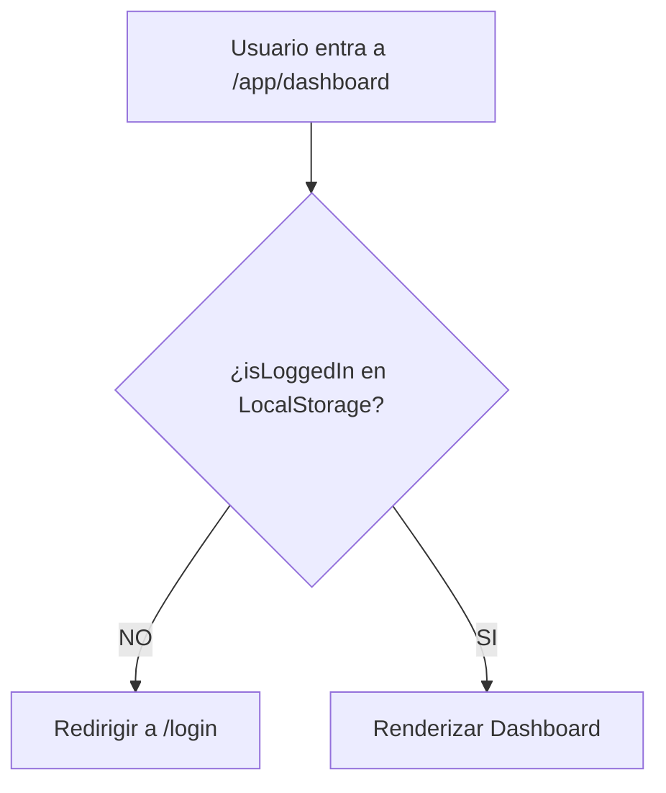

# Arquitectura de Autenticación - Smart Habit

Este documento detalla el flujo de seguridad implementado entre el Frontend (Angular) y el Backend (Spring Boot), integrando navegación, persistencia de sesión y seguridad contra ataques XSS/CSRF.

## 1. Componentes del Sistema

| Componente | Capa | Responsabilidad |
| :--- | :--- | :--- |
| **HttpOnly Cookies** | Backend | Almacena el JWT y el Refresh Token de forma segura. El JS no puede acceder a ellos. |
| **AuthGuard** | Frontend | Protege las rutas privadas (`/app/*`). Evita que usuarios no logueados vean la UI. |
| **AuthService** | Frontend | Gestiona el estado de sesión (`isLoggedIn`) y las llamadas a los endpoints de auth. |
| **HTTP Interceptor** | Frontend | (Propuesto) Adjunta credenciales y maneja errores 401 para disparar el Refresh. |

---

## 2. El Flujo de Navegación (AuthGuard)

El `AuthGuard` actúa como un checkpoint de navegación. No verifica la validez del token (porque no puede verlo), sino que verifica la **intención de sesión**.

---

## 3. Persistencia y Refresh Token

Para mantener la sesión viva sin que el usuario tenga que re-loguearse cada vez que expira el Access Token:

1.  **Expiración del Access Token**: Cuando una petición a la API devuelve un `401 Unauthorized`.
2.  **Disparo del Refresh**: El Interceptor captura el 401 y llama a `/api/auth/refresh`.
3.  **Renovación Silenciosa**:
    *   Si el Refresh Token es válido, el backend setea nuevas cookies.
    *   La petición original se re-intenta automáticamente.
4.  **Sesión Expirada (Hard Fail)**:
    *   Si el Refresh Token también venció, el `AuthService` debe ejecutar `logout()`.
    *   Se limpia el `localStorage.removeItem('isLoggedIn')`.
    *   El `AuthGuard` bloqueará la próxima navegación.

---

## 4. Seguridad (Blindaje)

*   **XSS Protection**: Al usar Cookies HttpOnly, un script malicioso no puede robar el token de sesión.
*   **CSRF Protection**: El backend debe estar configurado para validar el origen de las peticiones con cookies.
*   **Front-End Sync**: El flag `isLoggedIn` en `localStorage` es solo un indicador visual. La seguridad real reside en la validación de la cookie en cada petición al servidor.

---

## 5. Convenciones de Código

- Los Guards deben ser **Funcionales** (`canActivateFn`).
- El Logout debe ser **Duro** (`window.location.href`) para asegurar la limpieza total del estado de los servicios (Signals).
