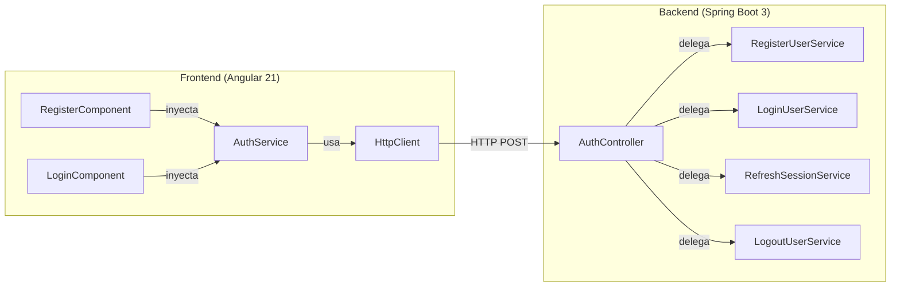
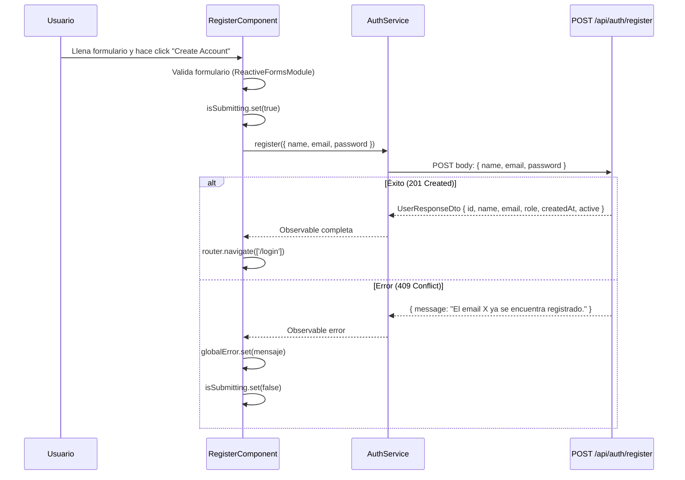
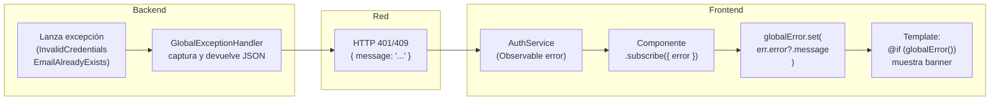

# Informe: Integración Frontend ↔ Backend — Flujo de Autenticación

> Fecha de elaboración: 2026-04-28  
> Frontend: Angular 21 (Standalone Components, Signals)  
> Backend: Spring Boot 3 (Clean Architecture, JWT)

---

## 1. Visión General de la Conexión

El frontend Angular se comunica con el backend Spring Boot a través de llamadas HTTP REST. El servicio `AuthService` del frontend actúa como **cliente HTTP** que consume los endpoints expuestos por el `AuthController` del backend.



---

## 2. Configuración de Red

### 2.1 Base URL

El `AuthService` construye su URL base desde las variables de entorno de Angular:

| Entorno | `environment.apiUrl` | URL final del AuthService |
|---|---|---|
| Desarrollo | `http://localhost:8080/api` | `http://localhost:8080/api/auth` |
| Producción | `/api` (relativo, detrás de nginx proxy) | `/api/auth` |

```typescript
// auth.service.ts
private readonly baseUrl = `${environment.apiUrl}/auth`;
```

En desarrollo, el frontend corre en `http://localhost:4200` y el backend en `http://localhost:8080`. Esto implica **cross-origin requests (CORS)**, lo que es relevante para el manejo de cookies.

### 2.2 Provisionamiento del HttpClient

```typescript
// app.config.ts — Estado ACTUAL
export const appConfig: ApplicationConfig = {
  providers: [
    provideBrowserGlobalErrorListeners(),
    provideRouter(routes)
    // ⚠️ FALTA: provideHttpClient(withFetch())
  ]
};
```

> **⚠️ HALLAZGO CRÍTICO**: Actualmente `app.config.ts` **no provee** `provideHttpClient()`. El `HttpClient` funciona solo porque Angular 21 lo inyecta implícitamente bajo ciertas condiciones, pero la configuración correcta debería incluirlo explícitamente. Esto será **obligatorio** cuando se agregue un `HttpInterceptor` para manejar el access token automáticamente.

---

## 3. Mapeo Endpoint por Endpoint

### 3.1 Registro (`/register`)



**Mapeo de tipos**:

| Frontend (TypeScript) | → | Backend (Java) |
|---|---|---|
| `RegisterRequest { name, email, password }` | → | `RegisterRequestDto { name, email, password }` |
| `UserResponse { id, name, email, role, createdAt, active }` | ← | `UserResponseDto { id, name, email, role, createdAt, active }` |

**Particularidades**:
- El registro **NO usa** `withCredentials: true` porque no maneja cookies — solo crea el usuario
- El campo `fullName` del formulario se mapea a `name` en el request: `name: formValue.fullName`
- Tras registro exitoso, redirige a `/login` (no auto-loguea)

---

### 3.2 Login (`/login`)

```mermaid
sequenceDiagram
    participant User as Usuario
    participant LC as LoginComponent
    participant AS as AuthService
    participant BE as POST /api/auth/login
    participant Cookie as Browser Cookie Store

    User->>LC: Ingresa email + password y hace click "Log In"
    LC->>LC: Valida formulario
    LC->>LC: isSubmitting.set(true)
    LC->>AS: login({ email, password })
    AS->>BE: POST body: { email, password } + withCredentials: true

    alt Éxito (200 OK)
        BE-->>AS: Body: { accessToken: "eyJhb..." }
        BE-->>Cookie: Set-Cookie: refreshToken=UUID; HttpOnly; Secure; Path=/api/auth/refresh; Max-Age=604800; SameSite=Strict
        AS-->>LC: TokenResponse { accessToken }
        LC->>LC: router.navigate(['/home'])
    else Error (401 Unauthorized)
        BE-->>AS: { message: "Invalid email or password" }
        AS-->>LC: Observable error
        LC->>LC: globalError.set(mensaje)
        LC->>LC: isSubmitting.set(false)
    end
```

**Mapeo de tipos**:

| Frontend (TypeScript) | → | Backend (Java) |
|---|---|---|
| `LoginRequest { email, password }` | → | `LoginRequestDto { email, password }` |
| `TokenResponse { accessToken }` | ← | `TokenResponseDto { accessToken }` |
| — *(cookie transparente)* | ← | `Set-Cookie: refreshToken=...` |

**El mecanismo de la cookie es INVISIBLE para el frontend**. El frontend nunca lee, almacena ni manipula el refresh token. El navegador lo gestiona automáticamente:

1. El backend emite `Set-Cookie` con `HttpOnly` → el JavaScript no puede acceder
2. `withCredentials: true` le dice al navegador: "incluí las cookies en esta petición cross-origin"
3. `Path=/api/auth/refresh` → el navegador SOLO envía la cookie a ese path específico

---

### 3.3 Refresh (`/refresh`)

```mermaid
sequenceDiagram
    participant AS as AuthService
    participant BE as POST /api/auth/refresh
    participant Cookie as Browser Cookie Store

    Note over AS: Access Token expiró (15 min)
    AS->>BE: POST body: {} + withCredentials: true
    Cookie->>BE: Cookie: refreshToken=old-UUID (automático)
    
    alt Token válido
        BE->>BE: Revoca token viejo (Token Rotation)
        BE->>BE: Genera nuevo JWT + nuevo RefreshToken
        BE-->>AS: Body: { accessToken: "nuevo-eyJhb..." }
        BE-->>Cookie: Set-Cookie: refreshToken=nuevo-UUID; ...
    else Token inválido/expirado
        BE-->>AS: 401 Unauthorized
        Note over AS: Redirigir a /login
    end
```

**Mapeo de tipos**:

| Frontend (TypeScript) | → | Backend (Java) |
|---|---|---|
| *body vacío* `{}` | → | — |
| `TokenResponse { accessToken }` | ← | `TokenResponseDto { accessToken }` |
| — *(cookie automática)* | ↔ | `@CookieValue("refreshToken")` |

**Particularidades**:
- El body va vacío: el refresh token viaja en la **cookie**, no en el body
- Actualmente este método **no se llama automáticamente** al expirar el token. Esto requiere un `HttpInterceptor` (pendiente de implementar)

---

### 3.4 Logout (`/logout`)

```mermaid
sequenceDiagram
    participant AS as AuthService
    participant BE as POST /api/auth/logout
    participant Cookie as Browser Cookie Store

    AS->>BE: POST body: {} + withCredentials: true
    Cookie->>BE: Cookie: refreshToken=UUID (automático)
    
    BE->>BE: Revoca el RefreshToken en DB
    BE-->>AS: Body: { message: "Logged out successfully" }
    BE-->>Cookie: Set-Cookie: refreshToken=; Max-Age=0 (borra la cookie)
```

**Mapeo de tipos**:

| Frontend (TypeScript) | → | Backend (Java) |
|---|---|---|
| *body vacío* `{}` | → | — |
| `MessageResponse { message }` | ← | `MessageResponseDto { message }` |

**Particularidades**:
- El backend establece `Max-Age=0` en la cookie para que el navegador la elimine
- Si no hay cookie (ya expiró), el backend simplemente responde OK sin error

---

## 4. Tabla de Correspondencia Completa: Modelos

### 4.1 Request Models

```
┌──────────────────────────────────┐    ┌──────────────────────────────────┐
│  Frontend (auth.model.ts)        │    │  Backend (DTOs)                  │
│                                  │    │                                  │
│  RegisterRequest {               │ ══►│  RegisterRequestDto {            │
│    name: string      ────────────┼────┤    @NotBlank String name         │
│    email: string     ────────────┼────┤    @NotBlank @Email String email  │
│    password?: string ────────────┼────┤    @NotBlank @Size(6) String pass │
│  }                               │    │  }                               │
│                                  │    │                                  │
│  LoginRequest {                  │ ══►│  LoginRequestDto {               │
│    email: string     ────────────┼────┤    @NotBlank @Email String email  │
│    password?: string ────────────┼────┤    @NotBlank String password      │
│  }                               │    │  }                               │
└──────────────────────────────────┘    └──────────────────────────────────┘
```

> **Nota**: En el frontend, `password` está marcado como `password?: string` (opcional con `?`). Esto es una **inconsistencia** — el backend lo marca como `@NotBlank` (obligatorio). Si se envía sin password, el backend responde `400 Bad Request`. El `?` debería eliminarse para que TypeScript detecte el error en tiempo de compilación.

### 4.2 Response Models

```
┌──────────────────────────────────┐    ┌──────────────────────────────────┐
│  Frontend (auth.model.ts)        │    │  Backend (DTOs)                  │
│                                  │    │                                  │
│  UserResponse {                  │ ◄══│  UserResponseDto {               │
│    id: number        ────────────┼────┤    Long id                       │
│    name: string      ────────────┼────┤    String name                   │
│    email: string     ────────────┼────┤    String email                  │
│    role: string      ────────────┼────┤    String role                   │
│    createdAt: string ────────────┼────┤    LocalDateTime createdAt       │
│    active: boolean   ────────────┼────┤    Boolean active                │
│  }                               │    │  }                               │
│                                  │    │                                  │
│  TokenResponse {                 │ ◄══│  TokenResponseDto {              │
│    accessToken: string ──────────┼────┤    String accessToken            │
│  }                               │    │  }                               │
│                                  │    │                                  │
│  MessageResponse {               │ ◄══│  MessageResponseDto {            │
│    message: string   ────────────┼────┤    String message                │
│  }                               │    │  }                               │
└──────────────────────────────────┘    └──────────────────────────────────┘
```

> **Nota**: `createdAt` es `LocalDateTime` en Java pero `string` en TypeScript. Jackson serializa `LocalDateTime` como `"2026-04-28T05:14:46"`. Si en el futuro se necesita operar con fechas en el front, hay que parsear este string a un `Date` o usar una librería como `date-fns`.

---

## 5. Flujo de Seguridad: `withCredentials`

La opción `withCredentials: true` es el puente entre el frontend y el sistema de cookies seguras del backend.

```
┌─────────────────────┐          ┌─────────────────┐         ┌───────────────┐
│  AuthService        │          │  Navegador       │         │  Backend      │
│  (Angular)          │          │  (Chrome/FF)     │         │  (Spring)     │
│                     │          │                  │         │               │
│  withCredentials:   │──HTTP──►│  Adjunta cookies │──HTTP──►│  Lee cookie   │
│  true               │          │  automáticamente │         │  @CookieValue │
│                     │◄─────── │  Almacena cookie │◄──────  │  Set-Cookie   │
│  (no toca cookies)  │          │  si Set-Cookie   │         │  HttpOnly     │
└─────────────────────┘          └─────────────────┘         └───────────────┘
```

### ¿Qué pasa si NO ponemos `withCredentials: true`?

Sin esta opción, el navegador **ignora** el `Set-Cookie` del backend en contexto cross-origin. La cookie nunca se almacena, y las llamadas a `/refresh` y `/logout` llegan sin cookie → el backend responde `401`.

### ¿Dónde se usa?

| Método | `withCredentials` | ¿Por qué? |
|---|---|---|
| `register()` | ❌ No | No maneja cookies (solo crea usuario) |
| `login()` | ✅ Sí | Recibe la cookie `Set-Cookie: refreshToken=...` |
| `refresh()` | ✅ Sí | Envía la cookie vieja, recibe cookie nueva |
| `logout()` | ✅ Sí | Envía la cookie, recibe cookie vacía (Max-Age=0) |

---

## 6. Estado Reactivo con Signals

El `AuthService` expone un `signal` para el estado global del usuario:

```typescript
readonly currentUser = signal<UserResponse | null>(null);
```

Actualmente **no se está usando activamente** — el login no guarda el usuario en este signal. Está preparado para cuando se implementen:
- Navbar condicional (mostrar nombre del usuario logueado)
- Guards de ruta (verificar si hay sesión activa)
- Perfil del usuario

Los componentes usan sus propios signals locales para estado de UI:

| Signal | Componente | Propósito |
|---|---|---|
| `isSubmitting` | Login, Register | Deshabilitar botón y mostrar "Processing..." |
| `globalError` | Login, Register | Mostrar banner de error del backend |

---

## 7. Manejo de Errores: Del Backend al Componente



El backend siempre devuelve errores en formato:
```json
{
  "timestamp": "2026-04-28T05:14:46",
  "status": 401,
  "error": "Unauthorized",
  "message": "Invalid email or password"
}
```

El frontend lee `err.error?.message` para obtener el texto legible. Si el backend no devuelve mensaje (e.g., 500 interno), el componente usa un **fallback hardcodeado**:
```typescript
// LoginComponent
this.globalError.set(err.error?.message || 'Invalid email or password. Please try again.');

// RegisterComponent
this.globalError.set(err.error?.message || 'The email address provided is already in use...');
```

---

## 8. Estado Actual y Piezas Pendientes

| Pieza | Estado | Descripción |
|---|---|---|
| `AuthService` | ✅ Completo | 4 métodos (register, login, refresh, logout) |
| `RegisterComponent` | ✅ Completo | Formulario con validación reactiva, errores por campo |
| `LoginComponent` | ✅ Completo | Formulario con validación reactiva, errores por campo |
| `provideHttpClient()` | ⚠️ Falta | No está en `app.config.ts` — necesario para prod |
| `HttpInterceptor` | ❌ Pendiente | Necesario para adjuntar `Authorization: Bearer` automáticamente en cada request protegido |
| Refresh automático | ❌ Pendiente | Cuando un request falla con 401, interceptar, llamar a `/refresh`, y reintentar el request original |
| `currentUser` signal | ⚠️ No usado | Declarado pero no se setea en login — preparado para futuro |
| `AuthGuard` | ❌ Pendiente | Guard de ruta para proteger páginas que requieren sesión |
| CORS config | ⚠️ Implícita | El backend no tiene `@CrossOrigin` ni `CorsConfiguration` explícita — puede fallar en desarrollo real |
| `password?` optional | ⚠️ Bug sutil | El `?` permite enviar sin password → 400 del backend |
