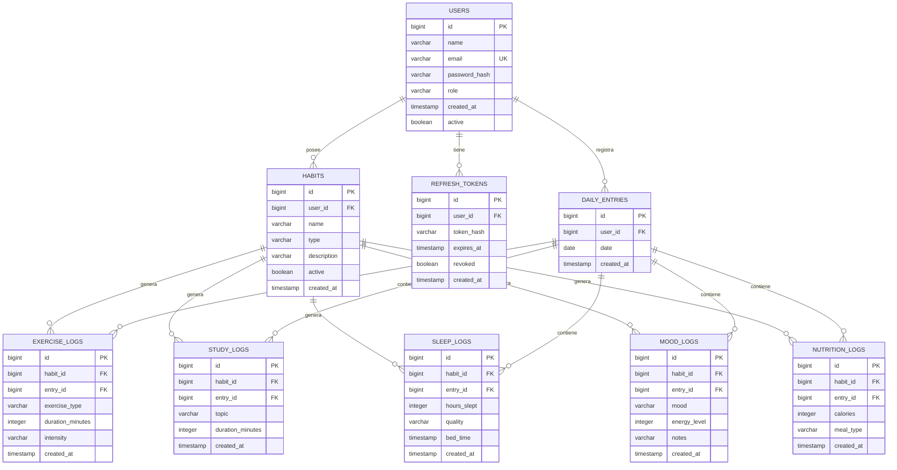
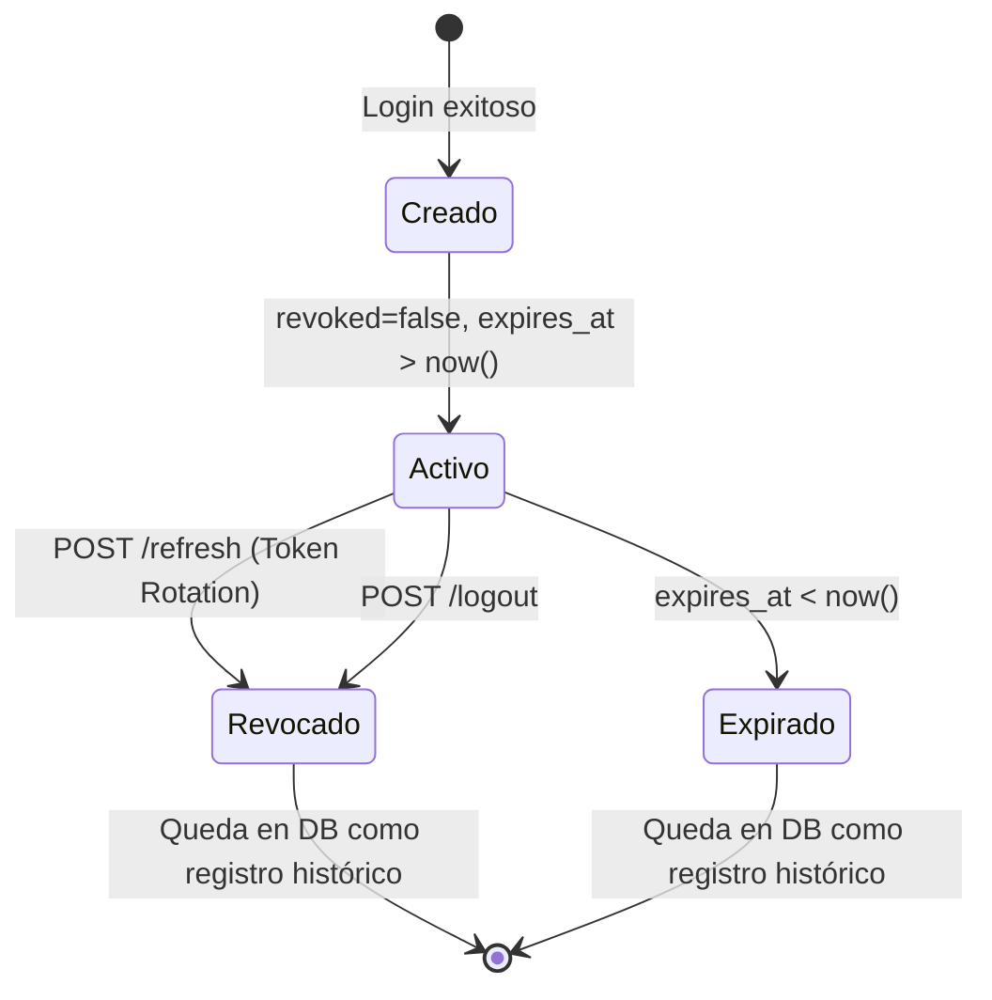

# Informe: Modelo de Datos y Relaciones de Entidades — Smart Habit

> Fecha de elaboración: 2026-04-28  
> Motor de base de datos: PostgreSQL 16 (Alpine)  
> ORM: JPA/Hibernate (Spring Data)

---

## 1. Diagrama Entidad-Relación (ERD)



---

## 2. Descripción de Entidades

### 2.1 `users` — Tabla central del sistema

La tabla `users` es el punto de partida de toda relación en el sistema. Todo recurso en la base de datos pertenece a un usuario.

**Entidad JPA**: `UserEntity`

| Columna | Tipo | Constraints | Descripción |
|---|---|---|---|
| `id` | `BIGINT` | PK, auto-increment | Identificador único |
| `name` | `VARCHAR` | NOT NULL | Nombre completo |
| `email` | `VARCHAR` | NOT NULL, UNIQUE | Email de acceso, clave de login |
| `password_hash` | `VARCHAR` | NOT NULL | Hash BCrypt de la contraseña |
| `role` | `VARCHAR` | NOT NULL | Rol del usuario (`USER`, `ADMIN`) |
| `created_at` | `TIMESTAMP` | NOT NULL | Fecha de alta |
| `active` | `BOOLEAN` | NOT NULL | Si la cuenta está habilitada |

**Relaciones salientes**:
- `users` → `refresh_tokens` (1:N) — Un usuario puede tener muchos refresh tokens activos
- `users` → `habits` (1:N) — Un usuario define múltiples hábitos
- `users` → `daily_entries` (1:N) — Un usuario genera entradas diarias

---

### 2.2 `refresh_tokens` — Tokens de refresco para sesión persistente

**Entidad JPA**: `RefreshTokenEntity`

| Columna | Tipo | Constraints | Descripción |
|---|---|---|---|
| `id` | `BIGINT` | PK, auto-increment | Identificador único |
| `user_id` | `BIGINT` | FK → `users.id`, NOT NULL | Dueño del token |
| `token_hash` | `VARCHAR` | NOT NULL | UUID v4 que identifica al token |
| `expires_at` | `TIMESTAMP` | NOT NULL | Expiración (7 días desde emisión) |
| `revoked` | `BOOLEAN` | NOT NULL | Si fue invalidado manualmente |
| `created_at` | `TIMESTAMP` | NOT NULL | Fecha de emisión |

**Relación JPA**:
```java
@ManyToOne(fetch = FetchType.LAZY)
@JoinColumn(name = "user_id", nullable = false)
private UserEntity user;
```

La relación es `ManyToOne` con carga `LAZY` — un usuario puede acumular múltiples refresh tokens a lo largo del tiempo (uno por cada login o refresh), pero solo el último no-revocado es válido.

---

### 2.3 `habits` — Hábitos del usuario

**Entidad JPA**: `HabitEntity`

| Columna | Tipo | Constraints | Descripción |
|---|---|---|---|
| `id` | `BIGINT` | PK, auto-increment | Identificador único |
| `user_id` | `BIGINT` | FK implícita, NOT NULL | Dueño del hábito |
| `name` | `VARCHAR` | NOT NULL | Nombre del hábito |
| `type` | `VARCHAR` | NOT NULL | Tipo: `EXERCISE`, `STUDY`, `SLEEP`, `MOOD`, `NUTRITION` |
| `description` | `VARCHAR` | nullable | Descripción libre |
| `active` | `BOOLEAN` | NOT NULL | Si el hábito está vigente |
| `created_at` | `TIMESTAMP` | NOT NULL | Fecha de creación |

> **Nota**: La FK `user_id` está definida como columna simple (`@Column`) sin `@ManyToOne` explícito, lo que significa que la relación se resuelve a nivel de consulta, no de JPA lazy-loading. Esto es una decisión de diseño para mantener la entidad liviana.

---

### 2.4 `daily_entries` — Registro diario del usuario

**Entidad JPA**: `DailyEntryEntity`

| Columna | Tipo | Constraints | Descripción |
|---|---|---|---|
| `id` | `BIGINT` | PK, auto-increment | Identificador único |
| `user_id` | `BIGINT` | FK implícita, NOT NULL | Dueño |
| `date` | `DATE` | NOT NULL | Fecha del registro |
| `created_at` | `TIMESTAMP` | NOT NULL | Fecha de creación |

**Constraint único**: `UNIQUE(user_id, date)` — Un usuario solo puede tener una entrada por día.

---

### 2.5 Tablas de Logs (por tipo de hábito)

Cada tipo de hábito tiene su propia tabla de log especializada. Todas comparten esta estructura base:

| Columna común | Descripción |
|---|---|
| `id` | PK auto-increment |
| `habit_id` | FK → `habits.id` |
| `entry_id` | FK → `daily_entries.id` |
| `created_at` | Fecha de registro |

Y agregan columnas específicas por tipo:

| Tabla | Columnas específicas |
|---|---|
| `exercise_logs` | `exercise_type`, `duration_minutes`, `intensity` |
| `study_logs` | `topic`, `duration_minutes` |
| `sleep_logs` | `hours_slept`, `quality`, `bed_time` |
| `mood_logs` | `mood`, `energy_level`, `notes` |
| `nutrition_logs` | `calories`, `meal_type` |

---

## 3. El Refresh Token en el Contexto de la Base de Datos

### 3.1 Ciclo de vida del RefreshToken en la DB



### 3.2 Acumulación de tokens

Cada vez que un usuario hace login o refresh, se crea una **nueva fila** en `refresh_tokens`. Los tokens anteriores quedan marcados como `revoked = true` pero **no se eliminan**. Esto tiene dos propósitos:

1. **Auditoría**: Se puede rastrear cuántas sesiones tuvo un usuario y cuándo
2. **Detección de robo**: Si un token revocado es usado, se sabe que hubo una filtración

### 3.3 Consultas frecuentes sobre refresh_tokens

| Operación | Query conceptual | Servicio que lo usa |
|---|---|---|
| Buscar token activo | `findByTokenHash(hash)` | `RefreshSessionService`, `LogoutUserService` |
| Crear nuevo token | `save(RefreshToken)` | `LoginUserService`, `RefreshSessionService` |
| Revocar token | `save(token con revoked=true)` | `RefreshSessionService`, `LogoutUserService` |

### 3.4 Relación RefreshToken ↔ User en capas

```
┌─────────────────────┐     ┌─────────────────────────┐
│  Dominio             │     │  Infraestructura (JPA)   │
│                     │     │                         │
│  RefreshToken       │     │  RefreshTokenEntity     │
│    userId: Long  ───┼─────┤►   user: UserEntity     │
│                     │     │    @ManyToOne(LAZY)      │
│                     │     │    @JoinColumn("user_id")│
│  User               │     │  UserEntity             │
│    id: Long      ───┼─────┤►   id: Long (PK)        │
└─────────────────────┘     └─────────────────────────┘
```

En el **dominio**, `RefreshToken` tiene un campo `userId` (simple `Long`). En la **infraestructura**, `RefreshTokenEntity` tiene una referencia JPA `@ManyToOne` a `UserEntity`. Los **mappers** de infraestructura se encargan de convertir entre ambas representaciones. Esto asegura que el dominio no conoce JPA.

---

## 4. Consideraciones Importantes

### 4.1 Limpieza de tokens expirados
Actualmente **no existe** un mecanismo de limpieza (job/scheduler) para eliminar tokens expirados o revocados de la tabla `refresh_tokens`. Con el tiempo, esta tabla crecerá indefinidamente. Se recomienda implementar un `@Scheduled` que periódicamente elimine registros donde `revoked = true` o `expires_at < now()`.

### 4.2 Índices recomendados
- `refresh_tokens.token_hash` → debería tener un índice UNIQUE para optimizar el `findByTokenHash()`
- `refresh_tokens.user_id` → ya tiene índice implícito por la FK
- `users.email` → ya tiene UNIQUE constraint

### 4.3 Cascade y eliminación
No hay cascadas definidas entre `users` y `refresh_tokens` a nivel JPA. Si se elimina un usuario, sus tokens quedarán huérfanos. Se debería considerar `ON DELETE CASCADE` en la FK de la base de datos o un mecanismo de soft-delete coordinado.
