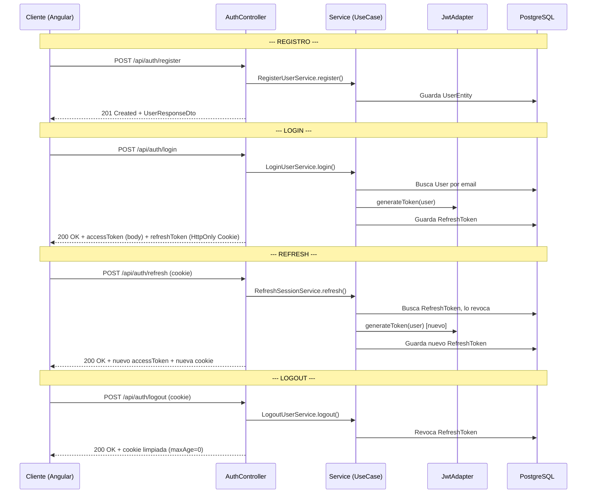
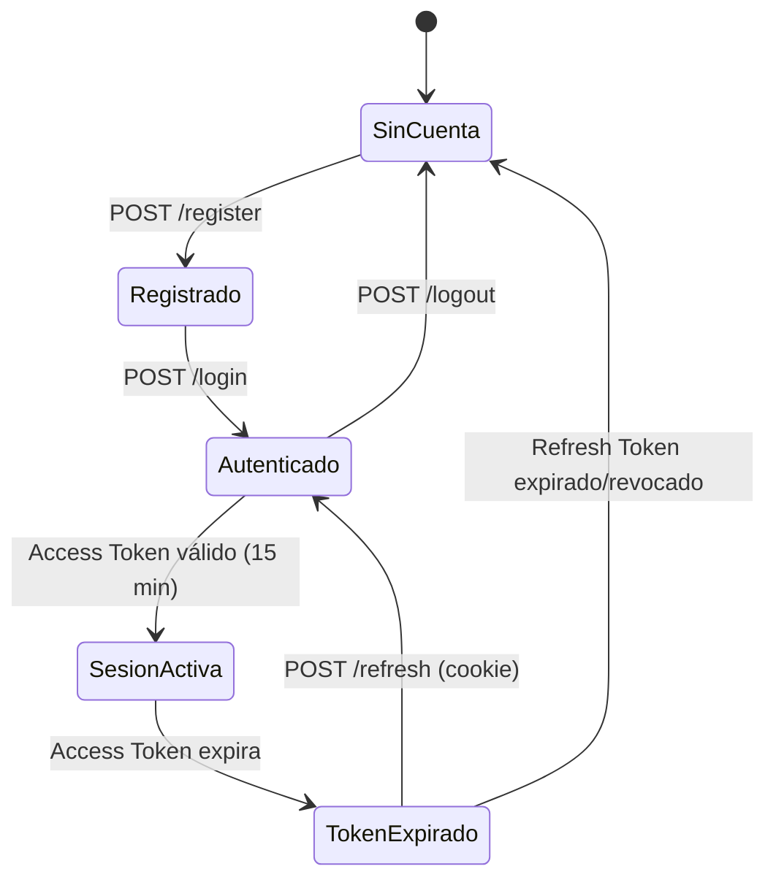

# Informe: Sistema de Autenticación — Smart Habit Backend

> Fecha de elaboración: 2026-04-28  
> Versión del sistema analizado: Spring Boot 3 + JWT (io.jsonwebtoken)

---

## 1. Visión General

El sistema de autenticación de Smart Habit implementa un flujo JWT stateless con **Refresh Token Rotation** (rotación de tokens), desplegado sobre Spring Security. La arquitectura sigue estrictamente **Clean Architecture (Hexagonal)**, donde la lógica de autenticación vive en la capa de aplicación sin dependencias del framework, y Spring Security actúa exclusivamente como infraestructura.

### Diagrama de flujo general



---

## 2. Capas Involucradas

### 2.1 Capa de Dominio

Los modelos de dominio son POJOs puros, sin dependencias de JPA ni Spring.

#### `User` (`domain.model.user.User`)
Representa al usuario autenticable del sistema.

| Campo | Tipo | Descripción |
|---|---|---|
| `id` | `Long` | Identificador único |
| `name` | `String` | Nombre completo |
| `email` | `String` | Email (login key) |
| `passwordHash` | `String` | Hash BCrypt de la contraseña |
| `role` | `String` | Rol del usuario (default: `"USER"`) |
| `createdAt` | `LocalDateTime` | Fecha de creación |
| `active` | `Boolean` | Si la cuenta está activa (default: `true`) |

Incluye un método `validate()` que valida invariantes de dominio (nombre, email y password no vacíos).

#### `RefreshToken` (`domain.model.token.RefreshToken`)
Representa un token de refresco emitido para mantener la sesión del usuario.

| Campo | Tipo | Descripción |
|---|---|---|
| `id` | `Long` | Identificador único |
| `userId` | `Long` | FK conceptual al User dueño |
| `tokenHash` | `String` | UUID v4 aleatorio que identifica el token |
| `expiresAt` | `LocalDateTime` | Fecha de expiración (7 días desde emisión) |
| `revoked` | `Boolean` | Si fue revocado manualmente (default: `false`) |
| `createdAt` | `LocalDateTime` | Fecha de creación |

Métodos de negocio:
- `isExpired()` → `true` si `now > expiresAt`
- `isValid()` → `true` si NO está revocado Y NO está expirado
- `revoke()` → marca `revoked = true`

#### Excepciones de dominio
- `InvalidCredentialsException` → lanzada cuando email o password no coinciden (401)
- `EmailAlreadyExistsException` → lanzada al intentar registrar un email duplicado (409)

---

### 2.2 Capa de Aplicación

#### Puertos de Entrada (Use Cases)

Definen los contratos que el controlador invoca. Son interfaces puras.

| Interface | Método | Retorno | Descripción |
|---|---|---|---|
| `RegisterUserUseCase` | `register(RegisterRequestDto)` | `UserResponseDto` | Crea un usuario nuevo |
| `LoginUserUseCase` | `login(LoginRequestDto)` | `AuthResultDto` | Autentica y emite tokens |
| `RefreshSessionUseCase` | `refresh(String tokenHash)` | `AuthResultDto` | Rota el refresh token |
| `LogoutUserUseCase` | `logout(String tokenHash)` | `void` | Revoca el refresh token |

#### Puertos de Salida (Ports out)

Definen los contratos que la infraestructura implementa. El dominio NUNCA sabe qué hay detrás.

| Interface | Métodos clave |
|---|---|
| `UserRepositoryPort` | `existsByEmail()`, `findByEmail()`, `findById()`, `save()` |
| `RefreshTokenRepositoryPort` | `save()`, `findByTokenHash()` |
| `JwtProviderPort` | `generateToken(User)`, `extractUserEmail(String)`, `isTokenValid(String, User)` |
| `PasswordEncoderPort` | `encode(String)`, `matches(String, String)` |

#### DTOs (Records inmutables)

| DTO | Campos | Uso |
|---|---|---|
| `RegisterRequestDto` | `name`, `email`, `password` | Body del POST `/register` |
| `LoginRequestDto` | `email`, `password` | Body del POST `/login` |
| `AuthResultDto` | `accessToken`, `refreshToken` | Resultado interno de login/refresh |
| `TokenResponseDto` | `accessToken` | Body de respuesta al cliente |
| `UserResponseDto` | `id`, `name`, `email`, `role`, `createdAt`, `active` | Respuesta tras registro |
| `MessageResponseDto` | `message` | Respuesta del logout |

#### Implementaciones de Use Cases

##### `RegisterUserService`
1. Verifica que el email no exista (`existsByEmail`)
2. Hashea la contraseña con `PasswordEncoderPort`
3. Construye el `User` de dominio con Builder
4. Persiste vía `UserRepositoryPort.save()`
5. Retorna `UserResponseDto` mapeado con `UserMapper`

##### `LoginUserService`
1. Busca al usuario por email → si no existe, lanza `InvalidCredentialsException`
2. Compara password raw vs hash con `PasswordEncoderPort.matches()`
3. Genera JWT (access token) con `JwtProviderPort.generateToken(user)`
4. Crea un `RefreshToken` de dominio con UUID aleatorio y expiración de 7 días
5. Persiste el RefreshToken
6. Retorna `AuthResultDto(accessToken, refreshTokenHash)`

##### `RefreshSessionService` (Refresh Token Rotation)
1. Busca el `RefreshToken` existente por `tokenHash` → si no existe, error
2. Valida que no esté revocado ni expirado (`isValid()`)
3. Busca al `User` dueño del token → verifica que esté activo
4. **Revoca** el token viejo (marca `revoked = true` y lo guarda)
5. Genera un **nuevo JWT** (access token)
6. Genera un **nuevo RefreshToken** con nuevo UUID
7. Retorna `AuthResultDto(nuevoAccessToken, nuevoRefreshTokenHash)`

> **Importante**: Este patrón de **Token Rotation** es una medida de seguridad. Si un atacante roba un refresh token y lo usa, el token legítimo del usuario ya está revocado. Si el usuario legítimo intenta refrescar después, fallará, indicando una posible brecha.

##### `LogoutUserService`
1. Busca el RefreshToken por hash
2. Lo revoca (`token.revoke()`)
3. Lo guarda (actualiza en DB)

---

### 2.3 Capa de Infraestructura

#### `AuthController` (`/api/auth`)

Es el punto de entrada HTTP. Todas las rutas son públicas (sin JWT requerido).

| Endpoint | Método | Request | Response |
|---|---|---|---|
| `/api/auth/register` | POST | `RegisterRequestDto` (body) | `201` + `UserResponseDto` |
| `/api/auth/login` | POST | `LoginRequestDto` (body) | `200` + `TokenResponseDto` + cookie `refreshToken` |
| `/api/auth/refresh` | POST | Cookie `refreshToken` | `200` + `TokenResponseDto` + nueva cookie |
| `/api/auth/logout` | POST | Cookie `refreshToken` | `200` + `MessageResponseDto` + cookie limpiada |

**Manejo de la cookie** (`buildRefreshCookie()`):
```java
ResponseCookie.from("refreshToken", value)
    .httpOnly(true)     // No accesible desde JavaScript
    .secure(true)       // Solo por HTTPS
    .path("/api/auth/refresh")  // Solo se envía a este path
    .maxAge(maxAge)     // 7 días para login, 0 para logout
    .sameSite("Strict") // No se envía en requests cross-site
    .build();
```

**¿Por qué la cookie tiene `path` restringido?** Porque el refresh token solo es necesario para refrescar la sesión. No tiene sentido que el navegador lo envíe en cada request a `/api/habits`, por ejemplo. Esto minimiza la superficie de ataque.

#### `JwtAdapter` (implementa `JwtProviderPort`)

Usa la librería `io.jsonwebtoken` (JJWT) para generar y validar tokens JWT.

- **Algoritmo**: HMAC-SHA (simétrico), clave leída desde `${jwt.secret}` en `application.properties`
- **Expiración del access token**: 15 minutos (`JWT_EXPIRATION = 1000 * 60 * 15`)
- **Claims**:
  - `sub` (subject): email del usuario
  - `role`: rol del usuario (e.g., `"USER"`)
  - `iat` (issued at): timestamp de emisión
  - `exp` (expiration): timestamp de expiración

```
Ciclo de vida del Access Token:
  Emisión → válido 15 min → expira → cliente debe refrescar con /refresh
```

#### `JwtAuthenticationFilter` (extiende `OncePerRequestFilter`)

Filtro que intercepta **cada request HTTP** antes de que llegue al controlador.

```
Request → [JwtAuthFilter] → [SecurityFilterChain] → Controller
```

Flujo interno del filtro:
1. Lee el header `Authorization`
2. Si no existe o no empieza con `"Bearer "` → pasa al siguiente filtro sin autenticar
3. Extrae el token (substring después de `"Bearer "`)
4. Intenta extraer el email del token → si falla (malformado/expirado), pasa sin autenticar
5. Si el email existe y no hay autenticación previa en el `SecurityContext`:
   - Busca al `User` por email en la DB
   - Valida el token contra el usuario (`isTokenValid`)
   - Si es válido, crea un `UsernamePasswordAuthenticationToken` con autoridades `ROLE_USER`
   - Lo inyecta en el `SecurityContextHolder`
6. Llama a `filterChain.doFilter()` para continuar la cadena

#### `SecurityConfig`

Configuración de Spring Security:

```java
http
    .csrf(csrf -> csrf.disable())                          // API REST stateless, no necesita CSRF
    .sessionManagement(session -> 
        session.sessionCreationPolicy(STATELESS))          // Sin sesiones HTTP
    .authorizeHttpRequests(auth -> auth
        .requestMatchers("/api/auth/**").permitAll()        // Auth endpoints públicos
        .anyRequest().authenticated()                      // Todo lo demás requiere JWT
    )
    .addFilterBefore(jwtAuthFilter, UsernamePasswordAuthenticationFilter.class);
```

#### `AuthUseCaseConfig`

Los use cases de auth (`LoginUserService`, `RefreshSessionService`, `LogoutUserService`) son clases POJO sin `@Service` ni `@Component`. Se instancian manualmente vía `@Bean` en esta clase `@Configuration`, inyectando los ports de salida como dependencias. Esto mantiene la capa de aplicación **libre de Spring**.

> `RegisterUserService` es la excepción: tiene `@Service` directamente (posible inconsistencia a corregir).

#### `GlobalExceptionHandler`

Manejo centralizado de errores con `@RestControllerAdvice`:

| Excepción | HTTP Status | Contexto |
|---|---|---|
| `EmailAlreadyExistsException` | `409 Conflict` | Registro con email duplicado |
| `InvalidCredentialsException` | `401 Unauthorized` | Login con credenciales incorrectas |
| `MethodArgumentNotValidException` | `400 Bad Request` | Validaciones `@Valid` fallidas |

---

## 3. Flujo Completo: De Registro a Sesión Activa



---

## 4. Resumen de Seguridad

| Mecanismo | Implementación |
|---|---|
| Hashing de contraseñas | BCrypt vía `PasswordEncoderPort` |
| Tokens de acceso | JWT HMAC-SHA, 15 min de vida |
| Tokens de refresco | UUID v4 en HttpOnly Secure Cookie, 7 días |
| Rotación de tokens | Cada `/refresh` revoca el token viejo y emite uno nuevo |
| Protección CSRF | Deshabilitado (API stateless, cookies SameSite=Strict) |
| Sesiones HTTP | `STATELESS` (no se crean sesiones en el servidor) |
| Cookie scope | `path=/api/auth/refresh` (mínima superficie de exposición) |
