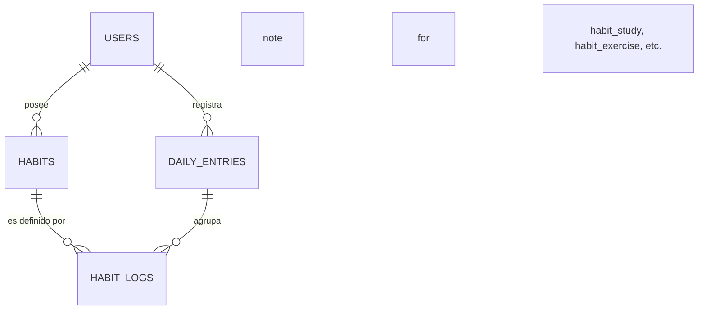

# Registro: Mapa de Relaciones de Base de Datos (Normalizado)

## Metadatos
- **Fecha:** 2026-04-22
- **Estado:** Aplicado (Esquema SQL)
- **Versión del Schema:** 1.2
- **Documento de Referencia:** [INFRASTRUCTURE-db.md](../../specs/INFRASTRUCTURE-db.md)

## Descripción de la Normalización
Se resolvió el "code smell" de dependencia transitiva. Anteriormente, los hábitos solo conocían al usuario a través de la fecha (`daily_entries`). Ahora, cada log de hábito conoce tanto a su **Definición** (el "Qué") como a su **Entrada Diaria** (el "Cuándo").

## Mapa de Relaciones (ERD)



### Detalle de Claves Foráneas (FK)

1.  **`habits`**
    - `user_id` -> `users(id)` (ON DELETE CASCADE)
    - *Propósito:* Define qué hábitos quiere trackear el usuario de forma persistente.

2.  **`daily_entries`**
    - `user_id` -> `users(id)` (ON DELETE CASCADE)
    - *Propósito:* Contenedor temporal único por día (`UNIQUE(user_id, date)`).

3.  **Tablas de Log (`habit_study`, `habit_exercise`, etc.)**
    - `habit_id` -> `habits(id)` (ON DELETE CASCADE)
    - `entry_id` -> `daily_entries(id)` (ON DELETE CASCADE)
    - *Propósito:* Registro de ejecución de un hábito específico en un día determinado.

## Beneficios Técnicos
- **Consultas de Progreso:** Se puede consultar el histórico de un hábito específico filtrando directamente por `habit_id` sin necesidad de `JOIN` con `daily_entries` si no se requiere la fecha exacta.
- **Integridad:** El uso de `CASCADE` asegura que si se elimina un hábito o un usuario, todos sus registros históricos se limpien automáticamente.
- **Flexibilidad:** Permite que un usuario tenga múltiples hábitos del mismo tipo (ej. dos rutinas de ejercicio distintas) manteniendo la trazabilidad por separado.

## Archivo de Migración
- `smart-backend/src/main/resources/db/migration/V8__normalize_habits_structure.sql`

## Motivo de la normalización
- Para ver que habitos tenía un usuario, simpre tenes que pasar por el log diario con el flujo Usuario -> DailyEntry -> habit_
- Ahora con la tabla habits el flujo es asi. Usuario -> Habit (Independiente del dia) | Usuario -> DailyEntry -> HabitLog (que referencia al Habit)

## Principal diferencia
- Antes
```mermaid
    Habit {
    id: 1
    userId: 42
    name: "Rutina de gym"
    type: EXERCISE
    active: true
    }
```
- Después
```mermaid
    ExerciseLog { habitId: 1, entryId: lunes,   exercised: true,  hours: 1 }
    ExerciseLog { habitId: 1, entryId: martes,  exercised: false, skipReason: "me lastimé" }
    ExerciseLog { habitId: 1, entryId: miércoles, exercised: true, hours: 2 }
```